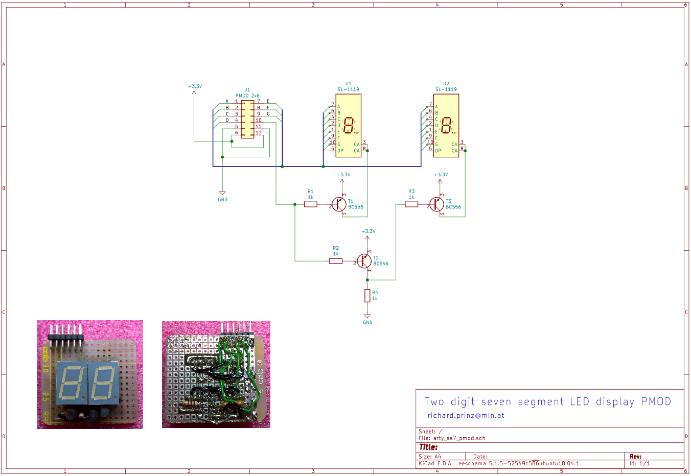

# Display7

A seven segment display driver for FPGA's written im Migen.

* Can handle up to 4 digits
* Display values in decimal or hexadecimal
* Configurable multiplex (refresh) rate
* Display can be flipped top to bottom depending on how
  it is installed

An example of a display which was used with Display7 is shown below.
Using two old [single digit displays](doc/SL-1119-7seg-LED.pdf) mounted on a piece of perfboard give a nice PMOD compatible display.

The example PMOD display does not use the decimal point LED. Instead this signal is used to multiplex between the two digits. This way only a single PMOD interface is required.
